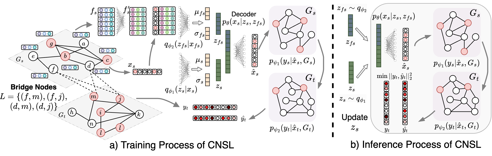

# Cross Network Source Localization

## Project Setup
Install the required packages.

`pip install -r requirements.txt`

## Data generation
The raw data has been uploaded here. Before running the model the data needs to be preprocessed by the following code.
### Cross-platform communication network data
`python communication_data_preprocess.py`
### Geo-social information spread data
`python geosocial_data_preprocess.py`

## Running Project
### Training
For running the default training:

`python train_model.py`

If you want to change the configuration, you can do it in the file [configuration.py](main/configuration.py) or you can follow the following example and change the parameter as per your needs.

* For example to change the number of epochs for training:

`python train_model.py -e 100`

### Inference
For running the default inference:

`python run_inference.py`

If you want to change the configuration, you can do it in the file [configuration.py](main/configuration.py) or you can follow the following example and change the parameter as per your needs.

* For example to change the number of epochs for inference:

`python run_inference.py -eInfer 100`

## Citation
If you use the data or the model of this work, please cite the following:

Ling, Chen, Tanmoy Chowdhury, Jie Ji, Sirui Li, Andreas Züfle, and Liang Zhao. "Source Localization for Cross Network Information Diffusion." arXiv preprint arXiv:2404.14668 (2024).
