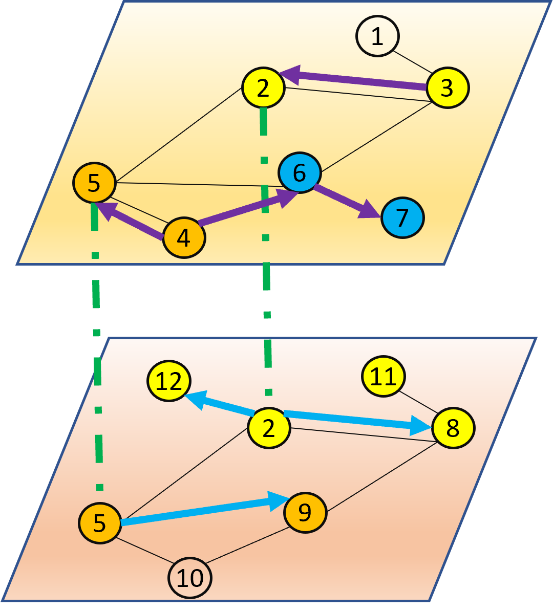

# Cross Network Source Localization
The goal of this project is to source localization of cross network.
<!---
## Sample Case
In Stackoveflow people share Github repositories. 
A malicious Github repositories can affect other repositories in Github as well as Stackoverflow.
For those two separate networks, if we know the affected posts of Stackoverflow, can we localize the source repositories on Github?
--->
## Problem Formulation

Two networks, nodes and edges are: 
* Projection Net, 𝐺𝑝𝑟𝑜𝑗, 𝑉𝑝𝑟𝑜𝑗, 𝐸_proj_
* Receiving Net, 𝐺𝑟𝑒𝑐, 𝑉𝑟𝑒𝑐, 𝐸𝑟𝑒𝑐

Edges:
* Observed Edges (Black), 𝐸𝑝𝑟𝑜𝑗, 𝐸𝑟𝑒𝑐
* Diffusion Edges
    * Projection Net (Purple), 𝐸'𝑝𝑟𝑜𝑗
    * Receiving Net (Blue), 𝐸'𝑟𝑒𝑐
    * Cross Net (Green Dotted), 𝐸𝑐𝑟𝑜𝑠𝑠
    
Example: 
* Yellow: 𝑣𝑝𝑟𝑜𝑗𝑠 = 3 started in 𝐺𝑝𝑟𝑜𝑗 which infected 𝑉𝑟𝑒𝑐i= [2, 8, 11, 12] in 𝐺𝑟𝑒𝑐
* Orange: 𝑣𝑝𝑟𝑜𝑗𝑠 = 4 started in 𝐺𝑝𝑟𝑜𝑗 which infected 𝑉𝑟𝑒𝑐i  = [5, 9] in 𝐺𝑟𝑒𝑐

Goal:

Find the nodes in 𝐺_𝑝𝑟𝑜𝑗  (Here 3 and 4) which are responsible for the infection in 𝐺𝑟𝑒𝑐 (Here [2, 8, 11, 12] and [5, 9]).
𝑉𝑟𝑒𝑐i  →𝑉𝑝𝑟𝑜𝑗𝑠
{[2, 8, 11, 12], [5, 9]} -> [3, 4]

## Project Setup
Install the required packages.

`pip install -r requirements.txt`

## Running Project
### Training
For running the default training:

`python train_model.py`

If you want to change the configuration, you can do it in the file [configuration.py](./main/configuration.py) or you can follow the following example and change the parameter as per your needs.

* For example to change the number of epochs for training:

`python train_model.py -e 100`

### Inference
For running the default inference:

`python run_inference.py`

If you want to change the configuration, you can do it in the file [configuration.py](./main/configuration.py) or you can follow the following example and change the parameter as per your needs.

* For example to change the number of epochs for inference:

`python run_inference.py -eInfer 100`

### Plotting
Look at the [plotting](./plotting) folder for the plotting of different stages.

[plotting_vae.py](./plotting/plotting_vae.py) will show the initial training of VAE:

[plotting_diffProj.py](./plotting/plotting_diffProj.py) will show the initial training of diffusion model for first network:

[plotting_diffRec.py](./plotting/plotting_diffRec.py) will show the initial training of diffusion model for second network:

[plotting_all.py](./plotting/plotting_all.py) will show the final training of the whole framework:

[plotting_all.py](./plotting/plotting_inference.py) will show the progress of inference:

